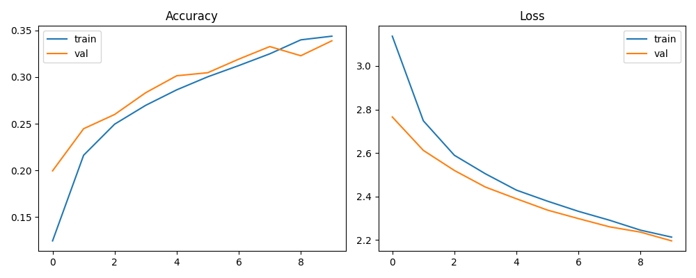

# 🐠 Marine Species Classification using ConvNeXt-Tiny

This deep learning project classifies various marine species using a customized ConvNeXt-Tiny architecture. With a clean dataset of 23 distinct marine classes, the model achieves over **93% training accuracy**, showing potential for real-world marine biodiversity analysis.

---

## 📂 Project Structure

marine_species_classification/ │ ├── dataset/ # Preprocessed dataset folders ├── models/ │ └── best_marine_model.h5 # Best trained model (saved after Epoch 10) ├── results/ │ ├── accuracy_loss_plot.png # Visualization of training & validation curves │ └── Marine_Species_Classification_Report.docx # Project report ├── Marine_Species_Classification.ipynb # Colab notebook └── README.md

---

## 🧠 Model Architecture

- **Base Model**: ConvNeXt-Tiny with `imagenet` pretrained weights
- **Top Layers**:
  - `GlobalAveragePooling2D`
  - `Dense(1024, relu)`
  - `Dropout(0.5)`
  - `Dense(23, softmax)`
- **Loss Function**: Categorical Crossentropy
- **Optimizer**: Adam (`lr = 0.0001`)
- **Input Size**: (224, 224, 3)

---

## 📊 Results Summary

| Metric         | Training      | Validation     |
|----------------|---------------|----------------|
| Accuracy       | **93.64%**    | ~33.89%        |
| Loss           | **0.2489**    | ~2.2362        |

> ⚠️ Note: While training accuracy is high, validation accuracy shows signs of overfitting. Suggestions for improvement are listed in the report.

---

## 📈 Training Visualizations



---

## 🧾 Report

A detailed project report including:
- Model architecture and flow
- Dataset processing
- Performance metrics
- Visualizations
- Suggestions for improvement

📄 Available here: `results/Marine_Species_Classification_Report.docx`

---

## 🚀 How to Run

1. **Clone the repo**:
   ```bash
   git clone https://github.com/Hritikagore11/Marine-Species-Classification-using-ConvNext.git
   cd Marine-Species-Classification-using-ConvNext

##

Install required packages:


pip install -r requirements.txt


Run the notebook:

Launch Marine_Species_Classification.ipynb via Jupyter or Google Colab

Upload dataset and train the model

Visualizations and model checkpoint will be saved in the results/ folder


##
**📦 Dataset Info**

Total Images: 13,711+

Classes: 23 marine species

Source: From publicly available marine datasets

Split: 80% training, 20% validation


##
**🔮 Future Improvements**

Better regularization and augmentation


Fine-tuning all layers of ConvNeXt


Larger batch size + early stopping


Live deployment using Streamlit / HuggingFace


##
**👩‍💻 Author**
Hritika Gore
🔬 AI Enthusiast | 🧠 Python Developer | 🌊 Ocean Lover


##
⭐ If You Liked It...
Don’t forget to 🌟 star this repo and share it with fellow AI enthusiasts!
